# Redis Cache & Database Architecture

> Comprehensive documentation explaining how Redis cache and PostgreSQL database systems work in the Triply project.

---

## Table of Contents

1. [Architecture Overview](#architecture-overview)
2. [Redis Cache System](#redis-cache-system)
3. [PostgreSQL Database System](#postgresql-database-system)
4. [Data Flow & Interactions](#data-flow--interactions)
5. [Multi-Tenancy](#multi-tenancy)
6. [Query Patterns](#query-patterns)

---

## Architecture Overview

This project uses a **dual-storage architecture** with clear separation of concerns:

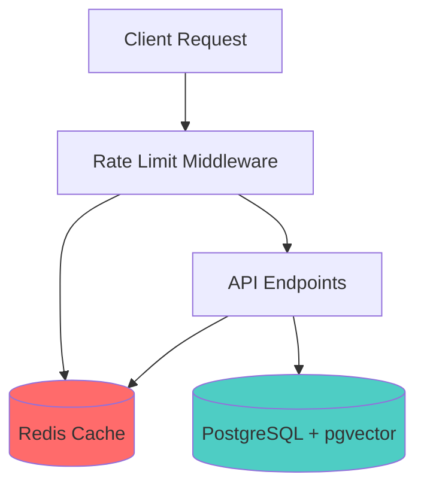

| Storage | Purpose | Characteristics | Data Lifetime |
|---------|---------|-----------------|---------------|
| **Redis** | Rate limiting, temporary lockouts | Fast, ephemeral, in-memory | 2-5 minutes (TTL) |
| **PostgreSQL** | Persistent data, relationships, vector search | ACID compliant, relational | Permanent |

---

## Redis Cache System

### Configuration

**Files:**
- [backend/app/config.py](../backend/app/config.py#L24-L27) - Configuration
- [.env](../.env#L4-L5) - Connection string
- [docker-compose.yml](../docker-compose.yml#L21-L32) - Container setup

```python
# Connection URL
REDIS_URL = "redis://localhost:6379/0"

# Docker container
redis:
  image: redis:7-alpine
  port: 6379
  volume: redis_data (persistent across restarts)
```

**Dependencies:** `redis>=5.0.0` ([pyproject.toml](../pyproject.toml#L36))

---

### Use Case 1: Rate Limiting (Token Bucket Algorithm)

**Location:** [backend/app/limits/rate_limit.py](../backend/app/limits/rate_limit.py)

#### How It Works

The **token bucket algorithm** is like having a bucket that:
1. Holds a maximum number of tokens
2. Refills continuously at a fixed rate
3. Each request consumes one token
4. When empty, requests are blocked

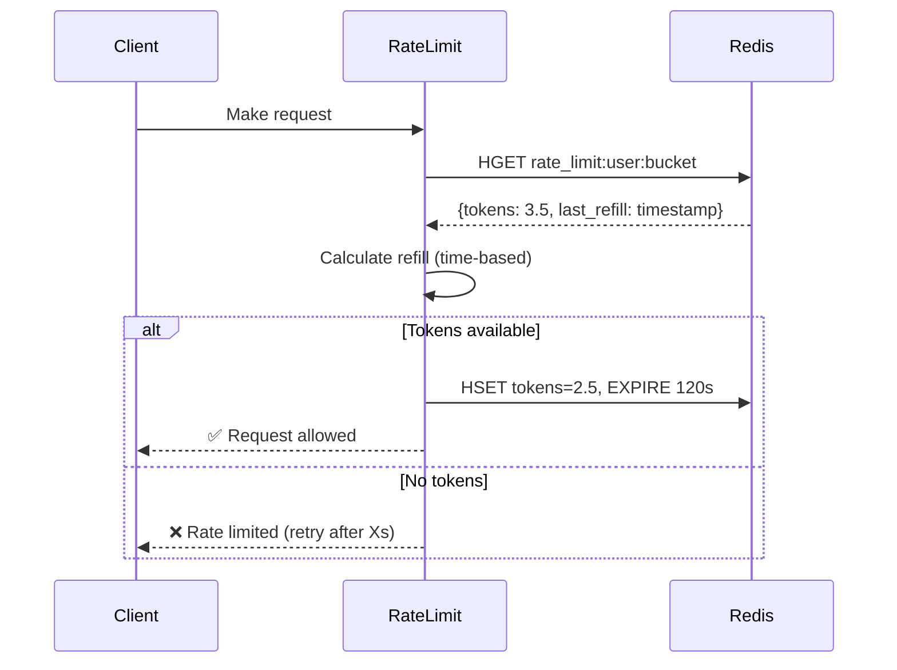

#### Redis Storage Structure

**Key Pattern:** `rate_limit:{user_id}:{bucket}`

**Data Structure:** Hash
```
Key: rate_limit:user123:agent
Fields:
  tokens: "3.5"           # Remaining tokens (float)
  last_refill: "1700000000.123"  # Unix timestamp
```

**TTL:** 120 seconds (auto-cleanup after inactivity)

#### Bucket Configuration

**Source:** [rate_limit.py Lines 16-19](../backend/app/limits/rate_limit.py#L16-L19)

| Bucket | Rate | Usage |
|--------|------|-------|
| `agent` | 5 requests/minute | AI operations (expensive) |
| `crud` | 60 requests/minute | Normal CRUD operations |

#### Code Flow

```python
# 1. Read current state (Lines 79-82)
tokens, last_refill = redis.hmget(key, "tokens", "last_refill")

# 2. Calculate refill (Lines 94-98)
time_passed = current_time - last_refill
refill_amount = (limit / 60.0) * time_passed
tokens = min(tokens + refill_amount, limit)

# 3. Consume token & update (Lines 107-111)
tokens -= 1
redis.hset(key, {"tokens": tokens, "last_refill": current_time})
redis.expire(key, 120)

# 4. Return result (Lines 114-131)
return (allowed=True/False, retry_after_seconds)
```

#### Functions

- **`check_rate_limit()`** (Lines 38-131): Check if request is allowed
- **`reset_rate_limit()`** (Lines 141-143): Clear rate limit (admin use)

---

### Use Case 2: Account Lockout Management

**Location:** [backend/app/security/lockout.py](../backend/app/security/lockout.py)

#### How It Works

Protects against brute-force attacks using a **sliding window**:
1. Track failed login attempts
2. After 5 failures → Lock account for 5 minutes
3. Window resets after 5 minutes of no attempts

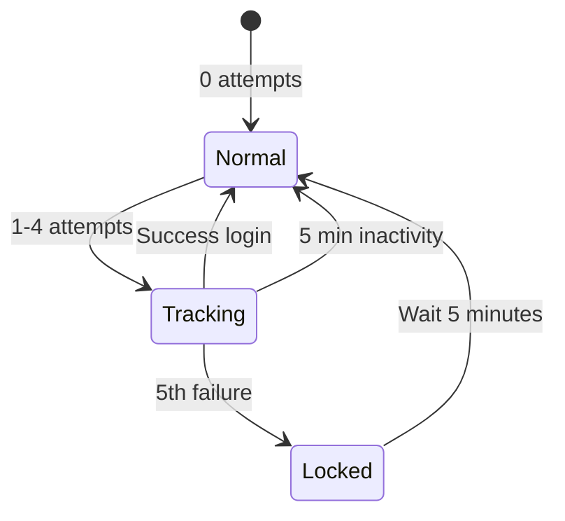

#### Redis Storage Structure

**Key Pattern:** `lockout:{user_id}`

**Data Structure:** Hash
```
Key: lockout:user456
Fields:
  attempts: "3"           # Failed login count
  locked_until: "2025-11-21T10:30:00Z"  # ISO datetime (if locked)
```

**TTL:**
- Active lockout: `lockout_duration + 60s` buffer
- Attempt tracking only: 300 seconds (5 minute window)

#### Configuration

**Source:** [config.py Lines 88-95](../backend/app/config.py#L88-L95)

```python
lockout_threshold = 5           # Failed attempts before lock
lockout_duration_minutes = 5    # Lock duration
```

#### Code Flow

```python
# 1. Check lockout status (Lines 44-67)
lockout_data = await redis.hgetall(f"lockout:{user_id}")
if locked_until and now < locked_until:
    return (locked=True, retry_after=seconds_remaining)

# 2. On login failure (Lines 76-85)
attempts += 1
if attempts >= threshold:
    locked_until = now + lockout_duration
    redis.hset(key, {"attempts": attempts, "locked_until": locked_until})
    redis.expire(key, lockout_duration + 60)
else:
    redis.hset(key, {"attempts": attempts})
    redis.expire(key, 300)  # 5 minute window

# 3. On login success (Lines 105, 136)
redis.delete(f"lockout:{user_id}")  # Clear lockout
```

#### Functions

- **`check_and_update_lockout()`** (Lines 27-123): Check/update lockout state
- **`clear_lockout()`** (Lines 126-138): Admin function to clear lockout

---

### Use Case 3: Middleware Rate Limiting (Lua Script)

**Location:** [backend/app/security/middleware.py](../backend/app/security/middleware.py)

#### How It Works

Path-specific rate limits using **atomic Lua scripts** to prevent race conditions.

#### Path Configuration

**Source:** [middleware.py Lines 56-63](../backend/app/security/middleware.py#L56-L63)

| Path | Rate | Purpose |
|------|------|---------|
| `/auth/login` | 10/min | Prevent brute force |
| `/auth/refresh` | 20/min | Token refresh |
| `/plan` | 5/min | Expensive AI operation |
| `/destinations` | 60/min | Normal operations |

#### Redis Storage Structure

**Key Pattern:** `rate_limit:{user_id or ip}:{path}`

**Data Structure:** Hash (same as Use Case 1)
```
Key: rate_limit:user123:/plan
Fields:
  tokens: "4.0"
  last_refill: "1700000000.123"
```

#### Why Lua Script?

**Problem:** Race conditions when multiple requests arrive simultaneously

**Solution:** Lua script executes atomically on Redis server

**Lua Script:** [Lines 157-184](../backend/app/security/middleware.py#L157-L184)

```lua
-- Atomic operations (no interruption possible)
local tokens, last_refill = redis.call('HMGET', key, 'tokens', 'last_refill')
-- ... calculate refill ...
redis.call('HMSET', key, 'tokens', new_tokens, 'last_refill', now)
redis.call('EXPIRE', key, window)
return {allowed, retry_after}
```

**Flow:**
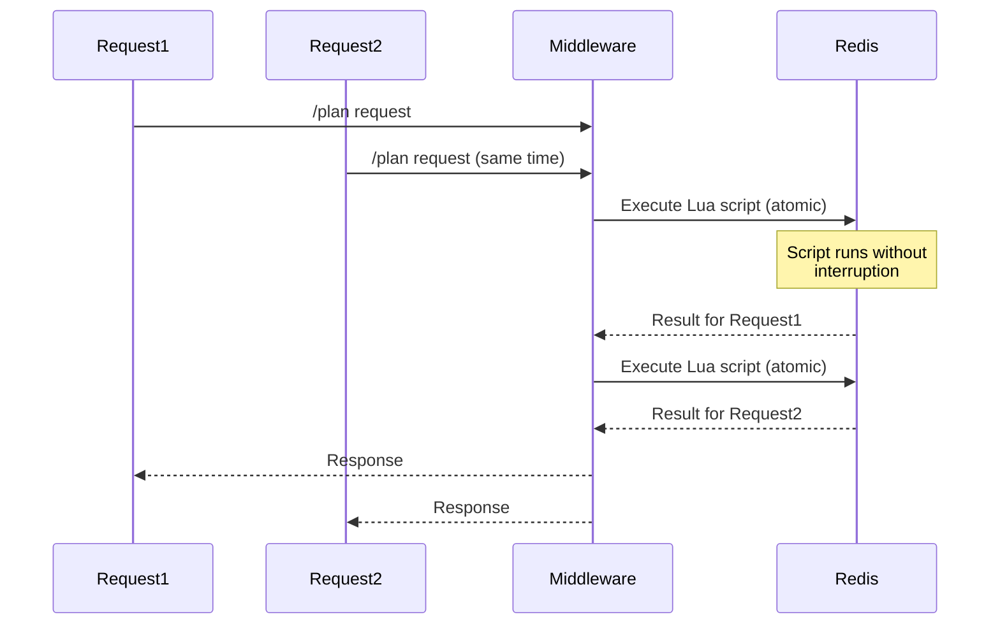

---

### Use Case 4: Health Check

**Location:** [backend/app/api/health.py](../backend/app/api/health.py#L42-L51)

Simple connectivity check:
```python
redis = redis.from_url(settings.redis_url)
status = "ok" if redis.ping() else "down"
```

---

### Redis Key Patterns Summary

| Use Case | Key Pattern | Data Type | TTL | Fields |
|----------|-------------|-----------|-----|--------|
| Rate Limiting | `rate_limit:{user}:{bucket}` | Hash | 120s | tokens, last_refill |
| Account Lockout | `lockout:{user_id}` | Hash | 300s or lockout duration | attempts, locked_until |
| Middleware Rate Limit | `rate_limit:{user\|ip}:{path}` | Hash | Dynamic | tokens, last_refill |

---

## PostgreSQL Database System

### Configuration

**Files:**
- [backend/app/config.py](../backend/app/config.py#L20-L23) - Configuration
- [.env](../.env#L2) - Connection string
- [docker-compose.yml](../docker-compose.yml#L4-L19) - Container setup

```python
# Connection URL
POSTGRES_URL = "postgresql://localhost:5432/triply"

# Docker container
postgres:
  image: pgvector/pgvector:pg16  # PostgreSQL 16 + vector extension
  port: 5432
  volume: postgres_data
```

**Dependencies:**
- `sqlalchemy>=2.0.0` - ORM
- `alembic>=1.12.0` - Migrations
- `psycopg2-binary>=2.9.0` - PostgreSQL driver
- `pgvector>=0.2.0` - Vector similarity search

---

### Connection Pooling

**Location:** [backend/app/db/session.py](../backend/app/db/session.py)

```python
# Engine configuration (Lines 15-26)
engine = create_engine(
    database_url,
    pool_pre_ping=True,      # Verify connections before use
    pool_size=5,             # 5 persistent connections
    max_overflow=10          # Up to 10 additional connections
)

# Session factory (Lines 29-39)
SessionLocal = sessionmaker(
    autocommit=False,        # Explicit transaction control
    autoflush=False,         # Manual flush control
    bind=engine
)

# Usage (Lines 42-58)
def get_db():
    db = SessionLocal()
    try:
        yield db
    finally:
        db.close()
```

---

### Database Schema

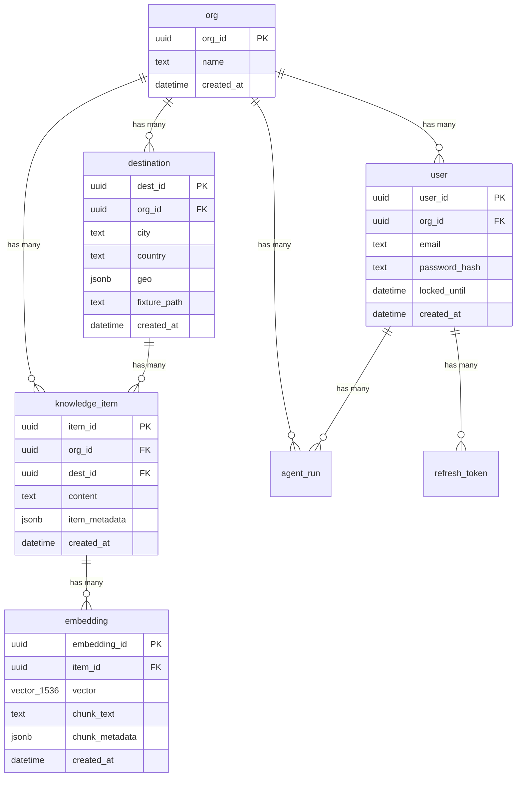

---

### Table 1: Organization

**File:** [backend/app/db/models/org.py](../backend/app/db/models/org.py)

```sql
CREATE TABLE org (
    org_id UUID PRIMARY KEY,
    name TEXT NOT NULL,
    created_at TIMESTAMP WITH TIME ZONE NOT NULL
);
```

**Purpose:** Multi-tenant isolation - each organization has separate data

**Relationships:**
- Has many: users, destinations, knowledge_items, agent_runs, itineraries

---

### Table 2: User

**File:** [backend/app/db/models/user.py](../backend/app/db/models/user.py)

```sql
CREATE TABLE user (
    user_id UUID PRIMARY KEY,
    org_id UUID NOT NULL REFERENCES org(org_id),
    email TEXT NOT NULL,
    password_hash TEXT NOT NULL,  -- Argon2id hashing
    locked_until TIMESTAMP WITH TIME ZONE,
    created_at TIMESTAMP WITH TIME ZONE NOT NULL,

    CONSTRAINT unique_org_email UNIQUE (org_id, email)
);

CREATE INDEX idx_user_org_id ON user(org_id);
```

**Purpose:** User authentication and account management

**Security:**
- Password hashing: **Argon2id** (industry standard, resistant to GPU attacks)
- Unique email per organization (same email allowed in different orgs)
- Database-level lockout support (`locked_until` for permanent bans)

**Relationships:**
- Belongs to: org
- Has many: refresh_tokens, agent_runs, itineraries

---

### Table 3: Refresh Token

**File:** [backend/app/db/models/refresh_token.py](../backend/app/db/models/refresh_token.py)

```sql
CREATE TABLE refresh_token (
    token_id UUID PRIMARY KEY,
    user_id UUID NOT NULL REFERENCES user(user_id),
    token_hash TEXT NOT NULL,  -- SHA-256 hash
    expires_at TIMESTAMP WITH TIME ZONE NOT NULL,
    revoked BOOLEAN DEFAULT FALSE,
    created_at TIMESTAMP WITH TIME ZONE NOT NULL
);

CREATE INDEX idx_refresh_token_user_revoked ON refresh_token(user_id, revoked);
```

**Purpose:** JWT refresh token rotation for secure authentication

**Security:**
- Tokens stored as **SHA-256 hashes** (never plaintext)
- Revocation support (logout, security breach)
- Expiration tracking

**Flow:**
1. User logs in → JWT access token (15 min) + refresh token (7 days)
2. Access token expires → Use refresh token to get new access token
3. Refresh token rotates (old one revoked, new one issued)
4. User logs out → Refresh token marked as revoked

---

### Table 4: Destination

**File:** [backend/app/db/models/destination.py](../backend/app/db/models/destination.py)

```sql
CREATE TABLE destination (
    dest_id UUID PRIMARY KEY,
    org_id UUID NOT NULL REFERENCES org(org_id),
    city TEXT NOT NULL,
    country TEXT NOT NULL,
    geo JSONB,  -- {"lat": 48.1351, "lon": 11.582}
    fixture_path TEXT,
    created_at TIMESTAMP WITH TIME ZONE NOT NULL,

    CONSTRAINT unique_org_destination UNIQUE (org_id, city, country)
);
```

**Purpose:** Travel destinations for itinerary planning

**JSONB Example:**
```json
{
  "lat": 48.1351,
  "lon": 11.582
}
```

**Constraints:**
- Each organization can have one entry per city/country combination
- Prevents duplicate destinations

---

### Table 5: Knowledge Item

**File:** [backend/app/db/models/knowledge_item.py](../backend/app/db/models/knowledge_item.py)

```sql
CREATE TABLE knowledge_item (
    item_id UUID PRIMARY KEY,
    org_id UUID NOT NULL REFERENCES org(org_id),
    dest_id UUID REFERENCES destination(dest_id),
    content TEXT NOT NULL,  -- Full document content
    item_metadata JSONB,    -- {"filename": "guide.pdf", "file_type": "pdf"}
    created_at TIMESTAMP WITH TIME ZONE NOT NULL
);

CREATE INDEX idx_knowledge_item_org_dest ON knowledge_item(org_id, dest_id);
```

**Purpose:** Stores uploaded documents for RAG (Retrieval Augmented Generation)

**Cascade Behavior:**
- When knowledge_item is deleted → All embeddings are deleted (CASCADE)

**JSONB Example:**
```json
{
  "filename": "munich_travel_guide.pdf",
  "file_type": "pdf",
  "page_count": 42
}
```

**Relationships:**
- Belongs to: org, destination (optional)
- Has many: embeddings

---

### Table 6: Embedding (Vector Search)

**File:** [backend/app/db/models/embedding.py](../backend/app/db/models/embedding.py)

```sql
CREATE TABLE embedding (
    embedding_id UUID PRIMARY KEY,
    item_id UUID NOT NULL REFERENCES knowledge_item(item_id) ON DELETE CASCADE,
    vector VECTOR(1536),     -- OpenAI ada-002 embedding (1536 dimensions)
    chunk_text TEXT,         -- Text this embedding represents
    chunk_metadata JSONB,
    created_at TIMESTAMP WITH TIME ZONE NOT NULL
);

-- IVFFLAT index for fast similarity search
CREATE INDEX idx_embedding_vector ON embedding
USING ivfflat (vector vector_cosine_ops)
WITH (lists = 100);
```

**Purpose:** AI-powered semantic search using vector embeddings

#### How Vector Search Works

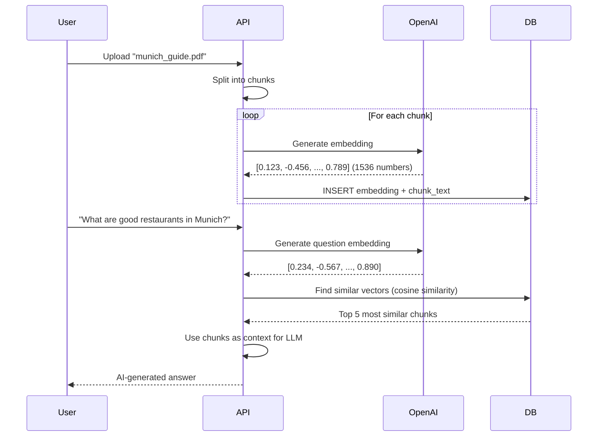

#### Vector Index (IVFFLAT)

**Created in:** [alembic/versions/001_initial_schema.py](../alembic/versions/001_initial_schema.py#L115-L117)

- **Algorithm:** IVFFLAT (Inverted File with Flat compression)
- **Similarity metric:** Cosine similarity
- **Lists:** 100 (balance between speed and accuracy)

**Why pgvector?**
- Native PostgreSQL extension (no separate vector database)
- ACID compliance (transactional integrity)
- Join vectors with relational data
- Production-ready for millions of vectors

---

### Table 7: Idempotency

**File:** [backend/app/db/models/idempotency.py](../backend/app/db/models/idempotency.py)

```sql
CREATE TABLE idempotency (
    key TEXT PRIMARY KEY,           -- Idempotency-Key header
    user_id UUID,
    org_id UUID,
    ttl_until TIMESTAMP WITH TIME ZONE NOT NULL,
    status TEXT NOT NULL,           -- "pending" | "completed" | "error"
    body_hash TEXT,                 -- SHA-256 of request body
    headers_hash TEXT,
    created_at TIMESTAMP WITH TIME ZONE NOT NULL
);

CREATE INDEX idx_idempotency_ttl
ON idempotency(ttl_until)
WHERE status = 'completed';
```

**Purpose:** Prevent duplicate requests (network retries, user double-clicks)

#### How It Works

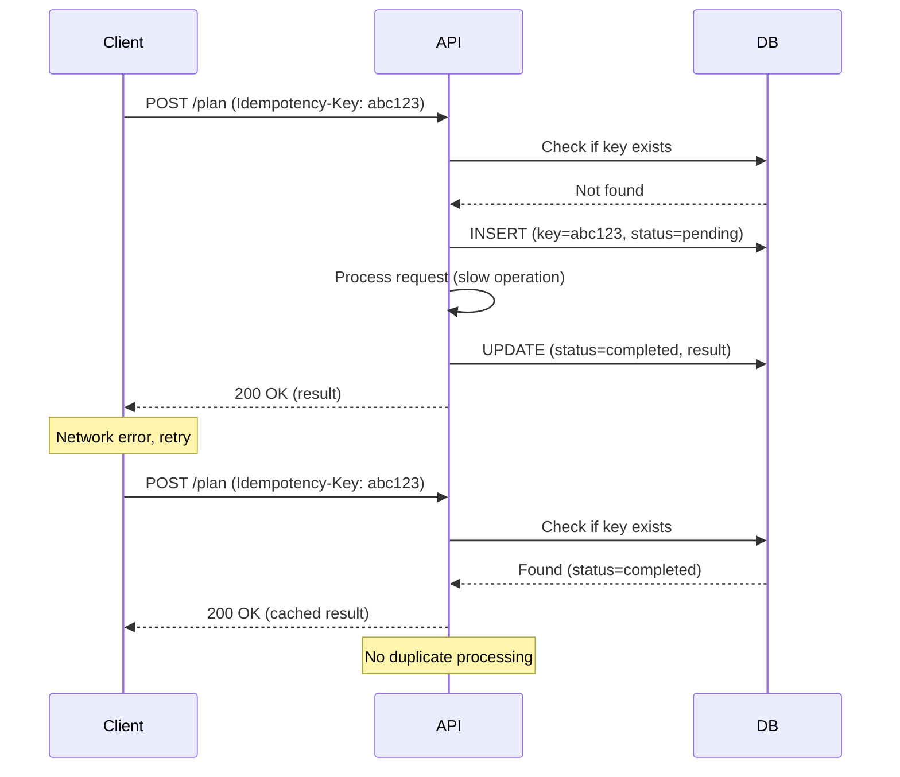

**Usage:** [backend/app/idempotency/store.py](../backend/app/idempotency/store.py)

**States:**
- `pending`: Request in progress
- `completed`: Request successful (result cached)
- `error`: Request failed (can retry)

**TTL:** Configurable (typically 24 hours)

---

### Table 8: Agent Run

**File:** [backend/app/db/models/agent_run.py](../backend/app/db/models/agent_run.py)

```sql
CREATE TABLE agent_run (
    run_id UUID PRIMARY KEY,
    org_id UUID NOT NULL REFERENCES org(org_id),
    user_id UUID NOT NULL REFERENCES user(user_id),
    intent JSON NOT NULL,               -- User's original request
    plan_snapshot JSON,                 -- Agent's execution plan
    tool_log JSON,                      -- Tools executed (debugging)
    cost_usd NUMERIC(10, 6),           -- API costs (OpenAI, etc.)
    trace_id TEXT,                      -- Distributed tracing
    status TEXT NOT NULL,               -- "running" | "completed" | "error"
    created_at TIMESTAMP WITH TIME ZONE NOT NULL,
    completed_at TIMESTAMP WITH TIME ZONE
);

CREATE INDEX idx_agent_run_org_user_created
ON agent_run(org_id, user_id, created_at);
```

**Purpose:** Audit trail and debugging for AI agent executions

**JSON Examples:**

```json
// intent
{
  "user_query": "Plan a 3-day trip to Munich",
  "preferences": {"budget": "moderate"}
}

// plan_snapshot
{
  "steps": [
    "Retrieve knowledge about Munich",
    "Generate itinerary",
    "Calculate costs"
  ]
}

// tool_log
[
  {"tool": "retrieve_knowledge", "args": {"city": "Munich"}, "timestamp": "2025-11-21T10:00:00Z"},
  {"tool": "generate_itinerary", "args": {"days": 3}, "timestamp": "2025-11-21T10:00:05Z"}
]
```

**Use Cases:**
- **Debugging:** What went wrong in failed runs?
- **Cost tracking:** How much did this operation cost?
- **Analytics:** Which features are used most?
- **Compliance:** Audit trail for AI decisions

---

## Data Flow & Interactions

### Key Principle: Redis and Database Are Separate

Redis and PostgreSQL **never synchronize data**. They serve completely different purposes:

| Aspect | Redis | PostgreSQL |
|--------|-------|------------|
| **Purpose** | Temporary state, rate limiting | Persistent data, relationships |
| **Data Loss** | Acceptable (will regenerate) | Unacceptable |
| **Consistency** | Eventual | ACID guaranteed |
| **Query Capability** | Key-value lookups | Complex queries, joins |

---

### Flow 1: Login with Rate Limiting & Lockout

**File:** [backend/app/api/auth.py](../backend/app/api/auth.py#L138-217)

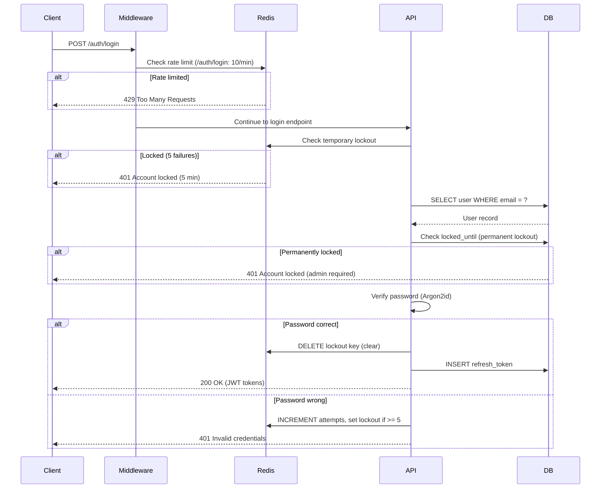

**Code:**
```python
# 1. Redis temporary lockout check (Line 162)
lockout_status = await check_and_update_lockout(user_id, success=False)

# 2. Database permanent lockout check (Lines 174-182)
if user.locked_until and datetime.now(timezone.utc) < user.locked_until:
    raise HTTPException(401, "Account locked")

# 3. Verify password (Line 185)
if not verify_password(password, user.password_hash):
    return {"error": "Invalid credentials"}

# 4. Clear Redis lockout on success (Line 197)
await clear_lockout(user_id)
```

---

### Flow 2: Knowledge Upload (Database Transaction)

**File:** [backend/app/api/knowledge.py](../backend/app/api/knowledge.py#L110-221)

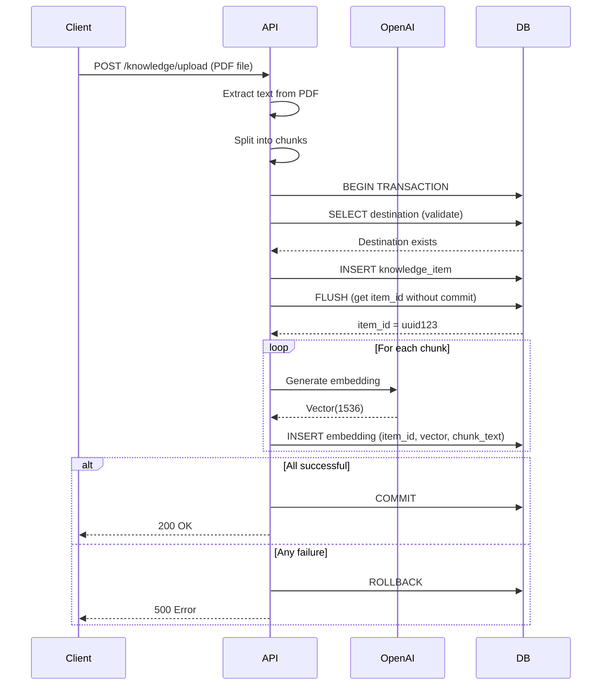

**Code:**
```python
# 1. Start transaction (implicit with session)
destination = db.query(Destination).filter(...).first()

# 2. Insert knowledge item (Lines 184-192)
knowledge_item = KnowledgeItem(
    org_id=org_id,
    dest_id=dest_id,
    content=content,
    item_metadata={"filename": file.filename}
)
db.add(knowledge_item)
db.flush()  # Get item_id without committing

# 3. Insert embeddings (Lines 198-212)
embeddings = [
    Embedding(item_id=knowledge_item.item_id, vector=vec, chunk_text=chunk)
    for vec, chunk in embeddings_data
]
db.add_all(embeddings)

# 4. Commit transaction (Line 214)
db.commit()  # All or nothing
```

**Why flush before commit?**
- Need `item_id` to insert embeddings
- Flush generates ID without committing
- If embedding insert fails, entire transaction rolls back

---

### Flow 3: RAG (Retrieve Knowledge)

**File:** [backend/app/graph/rag.py](../backend/app/graph/rag.py#L14-58)

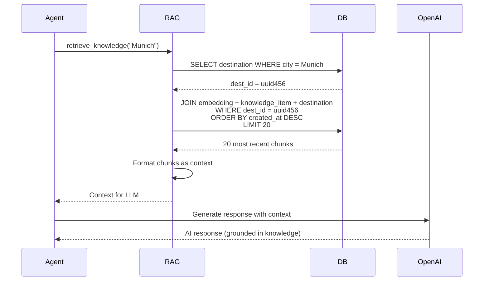

**Query:**
```python
# Simplified version of the query (Lines 44-52)
chunks = (
    db.query(Embedding.chunk_text, Embedding.chunk_metadata, KnowledgeItem.content)
    .join(KnowledgeItem, Embedding.item_id == KnowledgeItem.item_id)
    .join(Destination, KnowledgeItem.dest_id == Destination.dest_id)
    .filter(
        Destination.org_id == org_id,
        Destination.city == city
    )
    .order_by(KnowledgeItem.created_at.desc())
    .limit(20)
    .all()
)
```

**No Redis involvement** - Pure database query for persistent knowledge

---

### Flow 4: Tool Result Caching (In-Memory, NOT Redis)

**File:** [backend/app/exec/executor.py](../backend/app/exec/executor.py#L51-84)

**Surprising fact:** Uses Python dictionary, not Redis!

```python
class InMemoryToolCache:
    def __init__(self):
        self._cache = {}  # {key: (ToolResult, expires_at)}

    def get(self, key: str) -> Optional[ToolResult]:
        if key in self._cache:
            result, expires_at = self._cache[key]
            if datetime.now() < expires_at:
                return result
        return None

    def set(self, key: str, result: ToolResult, ttl_seconds: int):
        expires_at = datetime.now() + timedelta(seconds=ttl_seconds)
        self._cache[key] = (result, expires_at)
```

**Why not Redis?**
- Cache only needed during single agent run (seconds to minutes)
- No need to persist across requests
- Simpler and faster for temporary data
- Memory automatically freed when agent completes

**Cached tools:**
- Weather data: 24 hours TTL
- Exchange rates: 24 hours TTL

---

## Multi-Tenancy

### Design Principle: Organization-Scoped Data

**Every table** (except `org` and `idempotency`) has an `org_id` column for data isolation.

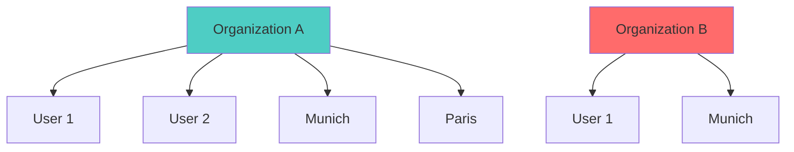

**Key point:** Organization A's "Munich" is separate from Organization B's "Munich"

---

### Tenant-Aware Helpers

**File:** [backend/app/db/tenancy.py](../backend/app/db/tenancy.py)

#### Function 1: scoped_query()

**Lines 17-50:** Automatically adds `org_id` filter

```python
# Without scoping (DANGEROUS - returns all orgs' data)
destinations = db.query(Destination).all()

# With scoping (SAFE - returns only org's data)
destinations = scoped_query(db, Destination, org_id).all()
```

#### Function 2: scoped_get()

**Lines 53-72:** Get single record by ID + org

```python
destination = scoped_get(
    db,
    Destination,
    org_id="org123",
    dest_id="uuid456"
)
# Returns None if destination belongs to different org
```

#### Function 3: scoped_list()

**Lines 75-108:** List with pagination

```python
destinations, total = scoped_list(
    db,
    Destination,
    org_id="org123",
    filters={"country": "Germany"},
    limit=20,
    offset=0
)
# Returns (items, total_count)
```

#### Function 4: scoped_count()

**Lines 111-133:** Count with filters

```python
count = scoped_count(
    db,
    KnowledgeItem,
    org_id="org123",
    filters={"dest_id": "uuid456"}
)
```

---

### Repository Pattern

**Lines 136-177:** `TenantRepository` class

```python
class TenantRepository:
    def __init__(self, db: Session, model: Type[Base], org_id: str):
        self.db = db
        self.model = model
        self.org_id = org_id

    def get(self, record_id: str):
        return scoped_get(self.db, self.model, self.org_id, record_id)

    def list(self, **filters):
        return scoped_list(self.db, self.model, self.org_id, filters)

# Usage
destination_repo = TenantRepository(db, Destination, org_id="org123")
munich = destination_repo.get(dest_id="uuid456")
```

**Benefits:**
- Encapsulates org filtering logic
- Prevents accidental cross-org data leakage
- Consistent API across models

---

## Query Patterns

### Pattern 1: Simple CRUD with Scoping

```python
# Create
destination = Destination(
    org_id=org_id,
    city="Munich",
    country="Germany",
    geo={"lat": 48.1351, "lon": 11.582}
)
db.add(destination)
db.commit()

# Read (scoped)
destination = scoped_get(db, Destination, org_id, dest_id)

# Update
destination.city = "München"
db.commit()

# Delete
db.delete(destination)
db.commit()
```

---

### Pattern 2: Complex Query with Joins

**Example:** Get all knowledge items for a destination

```python
query = (
    db.query(KnowledgeItem, Embedding)
    .join(Embedding, KnowledgeItem.item_id == Embedding.item_id)
    .join(Destination, KnowledgeItem.dest_id == Destination.dest_id)
    .filter(
        Destination.org_id == org_id,
        Destination.city == "Munich"
    )
    .order_by(KnowledgeItem.created_at.desc())
)
```

---

### Pattern 3: Vector Similarity Search

**Example:** Find similar documents

```python
# 1. Generate query embedding
query_embedding = openai.embeddings.create(
    model="text-embedding-ada-002",
    input="What are the best restaurants?"
).data[0].embedding

# 2. Find similar vectors
similar = (
    db.query(Embedding, KnowledgeItem)
    .join(KnowledgeItem)
    .filter(KnowledgeItem.org_id == org_id)
    .order_by(Embedding.vector.cosine_distance(query_embedding))
    .limit(5)
    .all()
)
```

**How it works:**
- pgvector's `cosine_distance()` function
- Uses IVFFLAT index for fast approximate nearest neighbor search
- Returns embeddings with smallest distance (most similar)

---

### Pattern 4: Transaction with Multiple Operations

**Example:** Create user with organization

```python
try:
    # Create org
    org = Organization(name="Acme Corp")
    db.add(org)
    db.flush()  # Get org_id without committing

    # Create user (linked to org)
    user = User(
        org_id=org.org_id,
        email="admin@acme.com",
        password_hash=hash_password("secret")
    )
    db.add(user)

    # Commit both
    db.commit()
except Exception as e:
    db.rollback()  # Undo all changes
    raise
```

**ACID properties:**
- **Atomic:** Both operations succeed or both fail
- **Consistent:** Constraints enforced (unique email, etc.)
- **Isolated:** Other transactions don't see partial state
- **Durable:** Once committed, data persists

---

### Pattern 5: Bulk Insert

**Example:** Insert multiple embeddings efficiently

```python
embeddings = [
    Embedding(
        item_id=item_id,
        vector=vec,
        chunk_text=chunk
    )
    for vec, chunk in zip(vectors, chunks)
]

# Single round-trip to database
db.add_all(embeddings)
db.commit()
```

---

## Best Practices

### Redis Best Practices

1. **Always set TTL** - Prevent memory leaks
   ```python
   redis.setex(key, 300, value)  # 5 minute expiry
   ```

2. **Use pipelines for atomicity** - Prevent race conditions
   ```python
   pipe = redis.pipeline()
   pipe.hset(key, "field1", value1)
   pipe.hset(key, "field2", value2)
   pipe.expire(key, 120)
   pipe.execute()
   ```

3. **Use Lua scripts for complex atomicity** - When multiple operations must be atomic
   ```python
   script = redis.register_script(lua_code)
   result = script(keys=[key], args=[arg1, arg2])
   ```

4. **Don't store large values** - Redis is in-memory (expensive)
   - ✅ Rate limit state (few bytes)
   - ❌ Full documents (use database)

5. **Handle Redis unavailability gracefully**
   ```python
   try:
       status = redis.ping()
   except redis.ConnectionError:
       # Fail open (allow requests) or fail closed (reject)?
       pass
   ```

---

### Database Best Practices

1. **Always use transactions** - Ensure consistency
   ```python
   try:
       db.add(record1)
       db.add(record2)
       db.commit()
   except:
       db.rollback()
   ```

2. **Use `flush()` when you need IDs mid-transaction**
   ```python
   db.add(parent)
   db.flush()  # Get parent.id
   child.parent_id = parent.id
   db.add(child)
   db.commit()  # Commit both
   ```

3. **Always scope queries by org_id** - Prevent data leakage
   ```python
   # BAD
   user = db.query(User).filter(User.email == email).first()

   # GOOD
   user = db.query(User).filter(
       User.org_id == org_id,
       User.email == email
   ).first()
   ```

4. **Use indexes for frequent queries**
   ```python
   # If you often query: WHERE org_id = ? AND dest_id = ?
   # Create composite index:
   CREATE INDEX idx_name ON table(org_id, dest_id);
   ```

5. **Use JSONB for flexible schemas** - But index carefully
   ```python
   # Query JSONB field
   db.query(Destination).filter(
       Destination.geo["lat"].astext.cast(Float) > 48.0
   )

   # Index JSONB field (if frequently queried)
   CREATE INDEX idx_geo_lat ON destination((geo->>'lat'));
   ```

6. **Batch operations for performance**
   ```python
   # BAD: N queries
   for item in items:
       db.add(item)
       db.commit()

   # GOOD: 1 transaction
   db.add_all(items)
   db.commit()
   ```

---

## Troubleshooting

### Redis Issues

**Problem:** Rate limits not working
```bash
# Check Redis connectivity
redis-cli ping  # Should return PONG

# Check keys
redis-cli KEYS "rate_limit:*"

# Inspect key
redis-cli HGETALL "rate_limit:user123:agent"
```

**Problem:** Memory issues
```bash
# Check memory usage
redis-cli INFO memory

# Clear all rate limits (dev only!)
redis-cli KEYS "rate_limit:*" | xargs redis-cli DEL
```

---

### Database Issues

**Problem:** Slow queries
```sql
-- Check query plan
EXPLAIN ANALYZE
SELECT * FROM embedding
WHERE item_id = 'uuid123';

-- Check missing indexes
SELECT schemaname, tablename, indexname
FROM pg_indexes
WHERE schemaname = 'public';
```

**Problem:** Connection pool exhausted
```python
# Check pool status
from sqlalchemy import inspect
inspector = inspect(engine)
print(engine.pool.status())

# Increase pool size (config.py)
engine = create_engine(url, pool_size=10, max_overflow=20)
```

**Problem:** Slow vector search
```sql
-- Rebuild IVFFLAT index (if outdated)
DROP INDEX idx_embedding_vector;
CREATE INDEX idx_embedding_vector ON embedding
USING ivfflat (vector vector_cosine_ops)
WITH (lists = 100);

-- Analyze table (update statistics)
ANALYZE embedding;
```

---

## Summary

### Architecture Philosophy

| Aspect | Redis | PostgreSQL |
|--------|-------|------------|
| **Data Type** | Ephemeral state | Persistent data |
| **Access Pattern** | Key-value lookups | Complex queries, joins |
| **Consistency** | Eventual | ACID guaranteed |
| **Data Loss** | Acceptable | Unacceptable |
| **Performance** | Sub-millisecond | Milliseconds |
| **Scalability** | Horizontal (cluster) | Vertical + read replicas |
| **Use Cases** | Rate limiting, caching, sessions | User data, relationships, vector search |

### Key Design Decisions

1. **Separation of Concerns** - Redis and DB never sync
2. **Multi-Tenancy** - All data scoped by `org_id`
3. **Security** - Argon2id passwords, SHA-256 tokens
4. **Vector Search** - pgvector for AI embeddings
5. **Transactions** - ACID compliance for data integrity
6. **Atomicity** - Lua scripts for Redis, transactions for DB

### File Reference Quick Links

**Redis:**
- Configuration: [config.py](../backend/app/config.py#L24-L27)
- Rate limiting: [rate_limit.py](../backend/app/limits/rate_limit.py)
- Lockout: [lockout.py](../backend/app/security/lockout.py)
- Middleware: [middleware.py](../backend/app/security/middleware.py)

**Database:**
- Configuration: [config.py](../backend/app/config.py#L20-L23)
- Session: [session.py](../backend/app/db/session.py)
- Models: [db/models/](../backend/app/db/models/)
- Tenancy: [tenancy.py](../backend/app/db/tenancy.py)
- Migrations: [alembic/versions/](../alembic/versions/)

---

**Last Updated:** 2025-11-21
