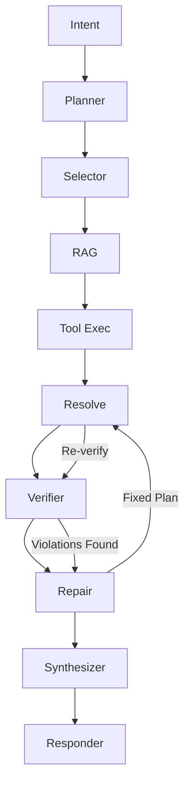

# Triply Travel Planner - Agentic AI Travel Advisor

An intelligent travel planning system that generates personalized 4-7 day itineraries with multi-constraint verification, deterministic repair loops, and real-time streaming updates. Built with FastAPI, LangGraph, Streamlit, and PostgreSQL with pgvector for RAG-enhanced planning.


## Video Demo

https://youtu.be/ze_R6Goon_E


## 🏗️ Architecture Overview

This is a production-ready mono-repo implementing an agentic travel planner with the following stack:

- **Backend**: FastAPI with LangGraph orchestration
- **Frontend**: Streamlit multi-page application
- **Database**: PostgreSQL with pgvector for RAG
- **Caching**: Redis for rate limiting and sessions
- **Authentication**: JWT with RSA keys
- **Tools**: 6+ integrated tools with MCP protocol support
- **Containerization**: Docker Compose for full stack deployment

### System Components

```
┌─────────────────┐    ┌─────────────────┐    ┌─────────────────┐
│   Streamlit UI  │◄──►│   FastAPI API   │◄──►│   PostgreSQL    │
│                 │    │                 │    │   + pgvector    │
│ • Chat Interface│    │ • Authentication│    │                 │
│ • Knowledge Mgmt│    │ • Rate Limiting │    │ • User Data     │
│ • Admin Pages   │    │ • Health Checks │    │ • Knowledge Base│
└─────────────────┘    └─────────────────┘    │ • Embeddings    │
                                │              └─────────────────┘
                                │              
                                ▼              ┌─────────────────┐
                       ┌─────────────────┐    │      Redis      │
                       │   LangGraph     │◄──►│                 │
                       │   Orchestrator  │    │ • Rate Limits   │
                       │                 │    │ • Sessions      │
                       │ • Intent        │    │ • Cache         │
                       │ • Planner       │    └─────────────────┘
                       │ • Selector      │    
                       │ • RAG           │    ┌─────────────────┐
                       │ • Tool Exec     │◄──►│  External Tools │
                       │ • Verifier      │    │                 │
                       │ • Repair        │    │ • Weather (MCP) │
                       │ • Synthesizer   │    │ • Flights       │
                       └─────────────────┘    │ • Lodging       │
                                              │ • Transit       │
                                              │ • Attractions   │
                                              └─────────────────┘
```

## 🔄 LangGraph Orchestration Flow

The system uses a sophisticated LangGraph-based orchestrator with typed state management and deterministic execution:



### Node Responsibilities

| Node | Purpose | Input | Output |
|------|---------|-------|--------|
| **Intent** | Parse user requirements | User input | Structured intent |
| **Planner** | Generate candidate plans | Intent + preferences | Multiple plan options |
| **Selector** | Choose optimal plan | Candidate plans | Selected plan |
| **RAG** | Retrieve local knowledge | Destination + plan | Knowledge chunks |
| **Tool Exec** | Execute external tools | Plan requirements | Tool results |
| **Resolve** | Merge tool data into plan | Plan + tool results | Enriched plan |
| **Verifier** | Check constraints | Enriched plan | Violations list |
| **Repair** | Fix constraint violations | Plan + violations | Repaired plan |
| **Synthesizer** | Generate final itinerary | Valid plan | Structured itinerary |
| **Responder** | Format response | Itinerary | User response |

### Typed State Management

```python
class OrchestratorState(BaseModel):
    """Typed state passed through all LangGraph nodes."""
    
    trace_id: str
    org_id: UUID
    user_id: UUID
    intent: IntentV1
    plan: PlanV1 | None
    candidate_plans: list[PlanV1]
    itinerary: ItineraryV1 | None
    violations: list[Violation]
    rag_chunks: list[str]
    messages: list[str]  # For streaming progress
    done: bool
```

## 🛠️ Tools & External Integrations

The system includes 6+ integrated tools with fallback mechanisms:

### Core Tools
1. **Weather Service** (MCP Protocol) - Real-time weather data with fallback
2. **Flight Search** - Flight options and pricing
3. **Lodging Search** - Hotels and accommodations
4. **Transit Planning** - Local transportation options
5. **Attractions & Events** - Local activities and events
6. **Currency Exchange** - Real-time exchange rates

### MCP Integration
- **Protocol**: Model Context Protocol for standardized tool interfaces
- **Fallback**: Automatic fallback to local fixtures on MCP server failure
- **Timeout Handling**: 5-second timeouts with graceful degradation

```python
# MCP Weather Tool Example
async with MCPClient("http://localhost:3001") as client:
    result = await client.call_tool("get_weather", {
        "city": "Paris",
        "date": "2025-06-01"
    })
```

## 📚 RAG System with pgvector

### Knowledge Base Architecture
- **Storage**: PostgreSQL with pgvector extension
- **Embeddings**: OpenAI embeddings with 1536 dimensions
- **Chunking**: Token-aware chunking (800 tokens with 100 token overlap)
- **Retrieval**: Semantic similarity search with organization scoping
- **PDF Support**: PyMuPDF with OCR for scanned documents

### Supported Document Formats
- **PDF**: Native text extraction + OCR for scanned documents
  - Digital PDFs: Fast native text extraction using PyMuPDF
  - Scanned PDFs: OCR using Tesseract (auto-triggered for low-text pages)
  - Hybrid PDFs: Combines native text with OCR for embedded images
- **Markdown**: Full markdown parsing with formatting preservation
- **Plain Text**: Standard UTF-8 text files

### PDF Processing Features
- **Hybrid Extraction**: Automatically detects scanned vs. digital PDFs
- **Smart OCR**: Only triggers OCR when page has <50 characters (configurable)
- **Image Extraction**: Extracts and OCRs embedded images within PDFs
- **Page Markers**: Preserves page boundaries for accurate citation
- **PII Protection**: Strips emails and phone numbers before embedding

### Citation-Level Tracking
```python
class Citation(BaseModel):
    """Citation with chunk-level attribution."""

    text: str
    source_doc: str
    chunk_id: str
    confidence: float
    page_number: int | None
```

### Knowledge Management API
```bash
# Upload documents (PDF, MD, TXT)
POST /destinations/{dest_id}/knowledge/upload
Content-Type: multipart/form-data
file: <PDF|MD|TXT file>

# List uploaded documents
GET /destinations/{dest_id}/knowledge/items

# View knowledge chunks
GET /destinations/{dest_id}/knowledge/chunks

# Example: Upload travel guide PDF
curl -X POST http://localhost:8000/destinations/{id}/knowledge/upload \
  -H "Authorization: Bearer $TOKEN" \
  -F "file=@kyoto_guide.pdf"
```

### OCR Configuration
Environment variables for PDF OCR control:
```bash
ENABLE_PDF_OCR=true              # Enable/disable OCR (default: true)
OCR_DPI_SCALE=2.0                # DPI scaling (2.0 = 144 DPI, higher = better quality)
OCR_MIN_TEXT_THRESHOLD=50        # Min chars before triggering OCR (default: 50)
TESSERACT_PATH=/usr/bin/tesseract  # Custom Tesseract path (optional)
```

## 🔐 Authentication & Security

### JWT Authentication
- **Algorithm**: RS256 with RSA key pairs
- **Access Tokens**: 15-minute expiry
- **Refresh Tokens**: 7-day expiry with rotation
- **Organization Scoping**: Multi-tenant architecture

### Security Features
- **Rate Limiting**: Token bucket algorithm with Redis
- **Password Security**: Argon2 hashing with salt
- **Account Lockout**: Progressive lockout on failed attempts
- **Security Headers**: CSP, HSTS, XSS protection
- **CORS**: Configurable origins for frontend integration

### API Authentication
```bash
# Login
POST /api/v1/auth/login
{
  "email": "user@example.com",
  "password": "secure_password"
}

# Use token
GET /api/v1/plans
Authorization: Bearer <access_token>
```

## 🚀 Quick Start

### Prerequisites
- Python 3.11+
- Docker & Docker Compose
- Node.js 18+ (for MCP server)
- **Tesseract OCR** (for PDF text extraction)
- **Poppler** (for PDF to image conversion)

### Development Setup

1. **Install System Dependencies**
```bash
# macOS
brew install tesseract poppler

# Ubuntu/Debian
sudo apt-get update
sudo apt-get install -y tesseract-ocr poppler-utils

# Verify installation
tesseract --version
```

2. **Clone and Install**
```bash
git clone <repository-url>
cd TriplyTakeHome
pip install -e .
```

3. **Environment Configuration**
```bash
cp .env.example .env
# Edit .env with your configuration:
# - Database URLs
# - JWT keys (generate with scripts/generate_keys.py)
# - API keys for external services
# - OCR settings (optional):
#   ENABLE_PDF_OCR=true
#   OCR_DPI_SCALE=2.0
#   OCR_MIN_TEXT_THRESHOLD=50
```

4. **Start Infrastructure**
```bash
docker-compose up -d postgres redis mcp-weather
```

5. **Database Setup**
```bash
# Run migrations
alembic upgrade head

# Seed database
python seed_db.py
```

6. **Start Backend**
```bash
cd backend
uvicorn app.main:app --reload --port 8000
```

7. **Start Frontend**
```bash
cd frontend
streamlit run Home.py --server.port 8501
```

### Production Deployment

```bash
# Full stack deployment
docker-compose up -d

# Health check
curl http://localhost:8000/healthz
```

## 📊 Monitoring & Observability

### Health Checks
- **Database**: Connection and query health
- **Redis**: Ping response
- **MCP Services**: Tool availability
- **External APIs**: Response time monitoring

### Metrics Collection
- Request/response times
- Tool execution duration
- Plan success/failure rates
- User authentication events

### Rate Limiting
- **Global**: 1000 requests/hour per IP
- **Authenticated**: 10000 requests/hour per user
- **Planning**: 10 plans/hour per user

## 🧪 Testing Strategy

### Test Categories

**Unit Tests** (`tests/unit/`)
- Model validation and serialization
- Business logic components
- Security functions
- Tool adapters

**Integration Tests** (`tests/integration/`)
- Full API endpoints
- Database operations
- LangGraph execution
- Authentication flows

**Scenario Tests** (`eval/`)
- End-to-end planning scenarios
- Constraint verification
- Tool integration
- Performance benchmarks

### Running Tests

```bash
# All tests
pytest -v

# With coverage
pytest --cov=backend --cov-report=html

# Specific categories
pytest -m unit          # Unit tests only
pytest -m integration   # Integration tests only
pytest eval/            # Scenario tests
```

### Evaluation Scenarios

The system includes comprehensive scenario testing:

```yaml
# Example scenario from eval/scenarios.yaml
scenario_id: happy_basic
description: "Basic Paris trip within budget"
intent:
  city: "Paris"
  budget_usd_cents: 250000  # $2,500
  date_window:
    start: "2025-06-01" 
    end: "2025-06-05"
must_satisfy:
  - predicate: "itinerary.cost_breakdown.total_usd_cents <= intent.budget_usd_cents"
    description: "Cost within budget"
  - predicate: "len(itinerary.citations) > 0"
    description: "Has RAG citations"
```

## ⚖️ Key Design Trade-offs

### ADR-001: Tri-State Booleans
**Decision**: Use `Optional[bool]` instead of custom enum
- **Pros**: JSON compatibility, Pydantic native support
- **Cons**: Less explicit than custom types
- **Impact**: Simplified serialization, clearer null semantics

### ADR-002: Money as Integer Cents
**Decision**: Store monetary values as integer cents
- **Pros**: Eliminates floating-point precision errors
- **Cons**: Requires conversion for display
- **Impact**: Financial accuracy, consistent calculations

### ADR-003: UTC + Timezone String Storage
**Decision**: Store UTC datetime + separate IANA timezone
- **Pros**: Handles DST correctly, historical accuracy
- **Cons**: More complex queries, two fields to maintain
- **Impact**: Reliable date/time handling across regions

### ADR-004: LangGraph vs Custom Orchestrator
**Decision**: Use LangGraph for workflow orchestration
- **Pros**: Checkpointing, parallelism, typed state
- **Cons**: Framework dependency, learning curve
- **Impact**: Robust workflow management, easier debugging

### ADR-005: Streaming vs Polling
**Decision**: Server-Sent Events for progress updates
- **Pros**: Real-time updates, lower latency
- **Cons**: Connection management complexity
- **Impact**: Better user experience, efficient resource usage

## 📈 Performance Characteristics

### Typical Performance
- **Plan Generation**: 3-8 seconds end-to-end
- **RAG Retrieval**: <500ms for 20 chunks
- **Tool Execution**: 1-3 seconds per tool
- **Database Queries**: <100ms for simple operations

### Scalability Considerations
- **Horizontal**: Stateless backend design enables scaling
- **Database**: Connection pooling and read replicas
- **Caching**: Redis for frequently accessed data
- **Rate Limiting**: Protects against abuse

## 🔧 Configuration Management

All configuration is centralized in environment variables:

```python
class Settings(BaseSettings):
    # Database
    database_url: str
    redis_url: str
    
    # Security  
    jwt_private_key_pem: str
    jwt_public_key_pem: str
    
    # External APIs
    weather_api_key: str
    mcp_weather_endpoint: str
    
    # Performance
    max_candidates: int = 5
    tool_timeout_seconds: float = 5.0
```

## 🚧 Known Limitations

### Current Constraints
- **Geography**: Optimized for major cities with good tool coverage
- **Languages**: English-only interface and content
- **Booking**: Planning only, no actual reservations
- **Offline**: Requires internet connectivity for tools

### Future Enhancements
- Multi-language support
- Offline planning capabilities
- Direct booking integration
- Advanced preference learning
- Group trip planning

## 📁 Project Structure

```
TriplyTakeHome/
├── backend/                 # FastAPI backend
│   └── app/
│       ├── api/            # REST API endpoints
│       ├── db/             # Database models & migrations
│       ├── graph/          # LangGraph orchestrator
│       ├── security/       # Authentication & authorization
│       ├── adapters/       # External tool integrations
│       └── models/         # Pydantic data models
├── frontend/               # Streamlit frontend
│   ├── pages/             # Multi-page app structure
│   ├── Home.py            # Main landing page
│   └── auth.py            # Authentication utilities
├── mcp-server/            # MCP weather service
├── eval/                  # Evaluation framework
├── tests/                 # Test suites
├── alembic/              # Database migrations
├── scripts/              # Utility scripts
└── docker-compose.yml    # Full stack deployment
```

### Pre-commit Hooks
```bash
pip install pre-commit
pre-commit install

# Manual run
pre-commit run --all-files
```
